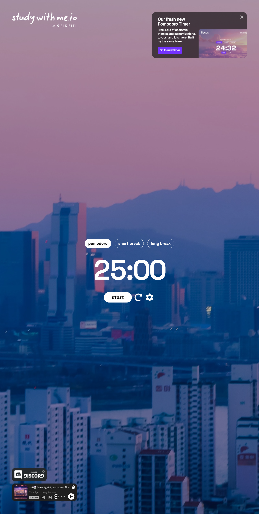

# Aesthetic Pomodoro Timer

A desktop-first Pomodoro timer built with Next.js, TypeScript, Tailwind CSS, and Space Grotesk. The product direction is an immersive focus workspace inspired by study-with-me timers: a clean countdown, automatic Pomodoro sequencing, visual progress, aesthetic backgrounds, todos, alert sounds, and optional cloud-synced settings.

The current implementation contains the core timer experience. The full v1 product scope is documented in [PRD.md](./PRD.md).



## Current Status

Implemented:

- Pomodoro, short break, and long break modes
- Default session lengths: 25 / 5 / 15 minutes
- Start, pause, and reset controls
- Drift-safe countdown based on `Date.now()` instead of interval-only decrements
- Automatic sequence: Pomodoro -> short break, with every fourth Pomodoro leading to a long break
- Four-dot Pomodoro cycle progress indicator
- Next.js App Router, TypeScript, Tailwind CSS, and Space Grotesk setup

Planned for v1:

- Video background themes with poster fallbacks
- Settings modal for durations, theme, sound, notifications, and account state
- Right-rail todo list with local persistence
- Alert sounds and browser notifications
- Live tab-title countdown and favicon updates
- Collapsible Spotify or YouTube lofi embed
- Optional Supabase sign-in with local-to-cloud migration
- FastAPI-backed settings and todo routes proxied under `/api/py/*`

## Tech Stack

- **Framework:** Next.js App Router
- **Language:** TypeScript
- **UI:** React, Tailwind CSS
- **Typography:** `@fontsource/space-grotesk`
- **Planned API:** FastAPI, exposed through Next.js rewrites
- **Planned persistence:** localStorage by default, Supabase for optional cloud sync

## Getting Started

### Prerequisites

- Node.js 20 or newer
- pnpm

### Install

```bash
pnpm install
```

### Run Locally

```bash
pnpm dev
```

Open [http://localhost:3000](http://localhost:3000).

### Production Build

```bash
pnpm build
pnpm start
```

### Supabase setup

Cloud sync is optional — the app runs fully anonymously against `localStorage`. To enable sign-in and cloud-synced settings/todos:

1. Create a project at [supabase.com](https://supabase.com).
2. Copy your project URL and anon key into a local `.env.local` file at the repo root:

   ```
   NEXT_PUBLIC_SUPABASE_URL=...
   NEXT_PUBLIC_SUPABASE_ANON_KEY=...
   ```

   A template lives in [`.env.local.example`](./.env.local.example). `.env.local` is gitignored.

3. Open the Supabase SQL editor for your project and run [`supabase/schema.sql`](./supabase/schema.sql). This creates the `settings` and `todos` tables and enables Row-Level Security so each user can only read and write their own rows.

## Available Scripts

```bash
pnpm dev        # Start the local development server
pnpm build      # Build the production app
pnpm start      # Start the production server
pnpm lint       # Run ESLint
pnpm typecheck  # Run TypeScript without emitting files
```

## Project Structure

```text
app/
  layout.tsx          Root layout, metadata, and font imports
  page.tsx            Main timer page
  globals.css         Tailwind import and global font variable

components/
  Timer.tsx           Timer display and composition
  ModePills.tsx       Pomodoro / short break / long break selector
  Controls.tsx        Start, pause, and reset controls

lib/
  timer/
    sequence.ts       Mode labels, default durations, and sequence state machine
    useTimer.ts       Drift-safe timer hook

PRD.md                Product requirements and v1 roadmap
```

## Timer Behavior

The timer avoids accumulating drift by storing an absolute end timestamp when a session starts:

```ts
endsAt = Date.now() + remainingMs;
```

Each animation frame computes the remaining time from the current clock value. This keeps the countdown accurate when the browser throttles background tabs or the device sleeps briefly.

The sequence state machine lives in [`lib/timer/sequence.ts`](./lib/timer/sequence.ts):

- Completing a Pomodoro increments the cycle count.
- Pomodoros 1-3 advance to a short break.
- Pomodoro 4 advances to a long break and resets the cycle count.
- Completing any break advances back to Pomodoro mode.

## Configuration

Default durations are currently defined in [`lib/timer/sequence.ts`](./lib/timer/sequence.ts):

```ts
export const DEFAULT_DURATIONS = {
  pom: 25,
  short: 5,
  long: 15,
};
```

Future settings work will move these values into user-editable state with localStorage persistence and optional Supabase sync.

## Planned Backend Integration

The repository already reserves a rewrite for the planned FastAPI backend:

```ts
source: "/api/py/:path*",
destination: "http://127.0.0.1:8000/api/py/:path*",
```

The intended v1 API surface includes:

- `GET /api/py/settings`
- `PUT /api/py/settings`
- `GET /api/py/todos`
- `POST /api/py/todos`
- `PATCH /api/py/todos/:id`
- `DELETE /api/py/todos/:id`

These routes are not required for the current timer-only implementation.

## Roadmap

The v1 delivery plan is tracked in [PRD.md](./PRD.md). Near-term milestones:

1. Add theme manifest and background video layer.
2. Add audio, browser notifications, tab title updates, and favicon countdown state.
3. Add todos with localStorage persistence.
4. Add settings modal and bind it to timer state.
5. Add Supabase auth, schema, row-level security, and local-to-cloud sync.
6. Polish metadata, accessibility, compressed assets, and deployment setup.

## Quality Checklist

Before shipping a change:

```bash
pnpm typecheck
pnpm lint
pnpm build
```

Manual smoke test:

1. Open the app and confirm the timer starts at `25:00`.
2. Start, pause, and reset the timer.
3. Switch between Pomodoro, short break, and long break modes.
4. Let a Pomodoro complete and confirm the app advances to a short break.
5. Complete four Pomodoros and confirm the app advances to a long break.

## License

No license has been added yet. Add one before distributing or accepting external contributions.
